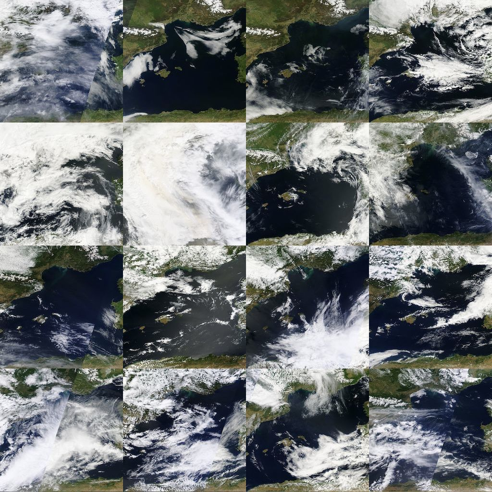

#WeatherLess

Trying to filtering weather noise from satellite images. Consider this "software" as a early alpha prototype.

##Results

There are the results using MODIS set of 60 images of Catalonia sector (r14c20) from year day 100 to 160 of 2013.

###Final image

###Performance

	$ time ./WeatherLess --InputPath ../data/standard/
	
	real	0m11.919s
	user	0m11.707s
	sys		0m0.103s

###Some used images

